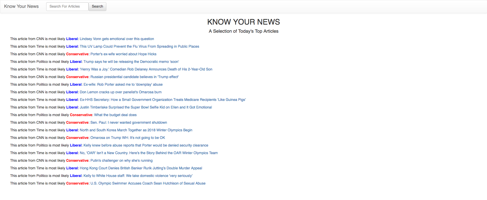

# news-aggregator

An early build of a service that collects and analyzes news articles. Done with [NewsAPI.org](https://newsapi.org/) and [Indico](https://indico.io).



Ugly as hell, I know. PRs welcome!

## Purpose

This is an MVP of the idea found [here](https://medium.com/@captainsidd/paying-for-a-news-aggregator-e88364fbfc0d). Branched off from the original idea somewhat, mostly to make building this more doable in a 24 hour hackathon - vast majority of this was done at Brickhack 4.

## Installation

You'll need API keys for both the NewsAPI and Indico. Once you have those, make the file `./lambda/environment.yml`:

``` yaml
NEWS_API_KEY: xxxxxxxxxx
INDICO_KEY: xxxxxxxxxx
```

Then install [Serverless](https://serverless.com), and make sure you can deploy to AWS with AWS credentials setup in your `bash_profile`

To deploy:

```sh
cd lambda
npm install
sls deploy
```

This will display two different endpoints, the base of which should replace `const BASE_URL` in `news-aggregator-web/src/App.js`.

Note: Haven't got the frontend up and running anywhere - want to handle the rate limit issue for the Indico API before the site is publically available.

